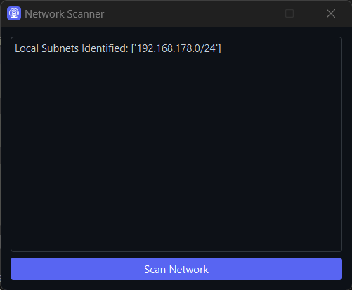

# Local Network Scanner

This is a Python script that implements a network scanner using the ARP protocol. It allows you to scan local subnets and discover devices connected to the network.

## Prerequisites

Before running the script, make sure you have the following dependencies installed:
- `psutil`
- `PyQt6`
- `scapy`

You can install these dependencies using pip:

```python
pip install psutil PyQt6 scapy
```

## Functions

1. **get_local_subnets()**: Gets all local subnets of the host.
2. **scan_subnet(target_ip)**: Performs an ARP scan on a specified subnet.
3. **apply_github_theme(q_app)**: Wendet ein GitHub-ähnliches Design auf die GUI an.

## Usage

To run the network scanner, execute the following command:
```python
python main.py
```
Once the application window opens, click the "Scan Network" button to start scanning. The script will identify the local subnets and perform an ARP scan in each subnet. The results will be displayed in the text box.

## Customization

You can customize the appearance of the application by modifying the github.qss file located in the assets directory. This file contains the CSS styles for the GitHub theme applied to the application.

## Screenshots



## Author

Developed with 💻 and ❤️ by [EvickaStudio](https://github.com/EvickaStudio).
